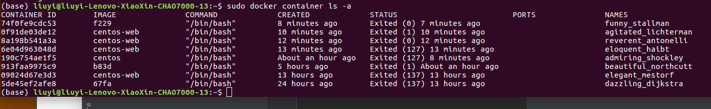
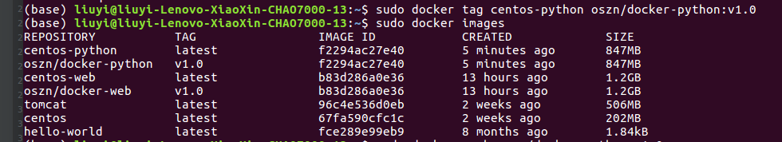
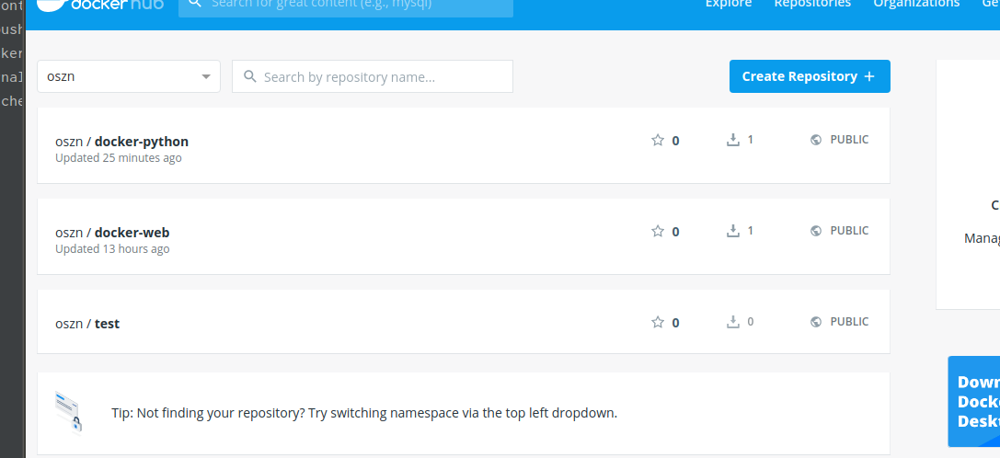
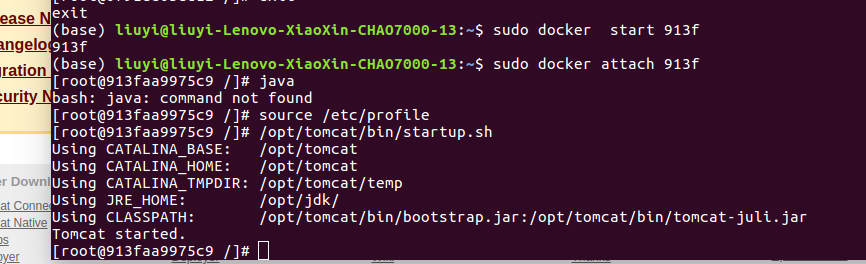
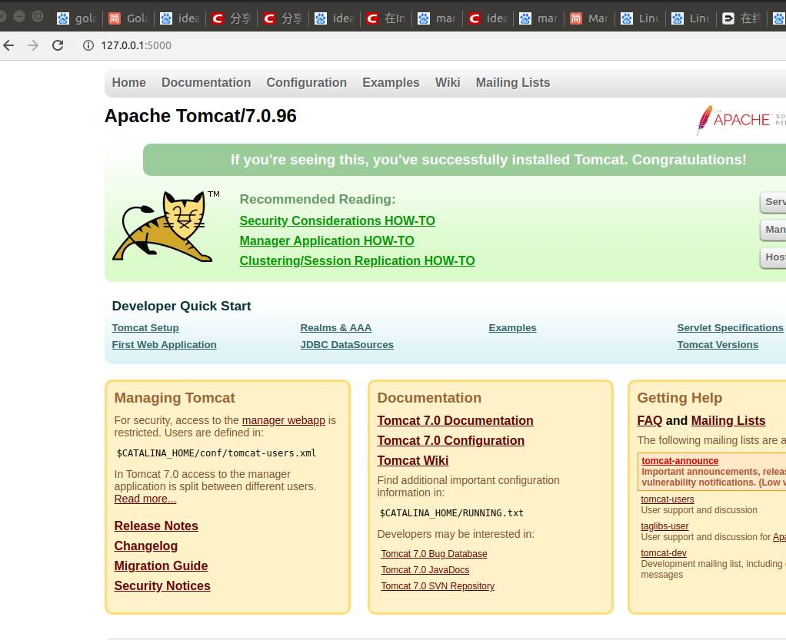

[toc]
##Docker
###frequently instruction
```shell script
sudo docker images//查看镜像
sudo docker ps//查看正在运行的容器
sudo docker container ls -a//查看所有创建的容器
sudo docker rm <ImageId>//删除容器
sudo docker rmi <ImageId>//删除镜像
sudo docker start <ImageId>//开始一个容器
sudo attach <ImageId>//进入一个容器
```
###如何打包一个镜像
找到一个容器的编号

例如containerID为5de45ef2afe8这个镜像
只需要
```shell script
sudo docker commit <ImageID> <ImageName(create by youself)>
exmaple:
sudo docker commit 5de45ef2afe8 centos-python
```
至于其他的一些参数可以去百度下
###如何上次镜像
1.你的现有一个docker账号:

我的账号为我的qq邮箱，即qq号加@qq.com  
密码是19991119ly

2.在终端中登录
```shell script
sudo docker login
依次输入账号密码即可
```
这个时候应该登录成功了.

3.然后就讲镜像tag标签依次便于管理
```shell script
sudo docker tag centos-python oszn/docker-python:v1.0
这里后面就是oszn是仓库名
docker-Python是文件名
v1.0代表版本
```
完成这个操作之后会生成一个和之前镜像一模一样id的镜像


4.提交
```shell script
sudo docker push oszn/docker-python:v1.0
```
然后等待上传
可以看到docker的远程仓库


###如何讲电脑文件移入到容器中
```shell script
demo
sudo docker cp /usr/dkfole/Python-3.7.4.tgz 190c754ae1f5:/mnt
前面是本地文件的位置,后面是容器中文件的位置
```

###端口映射
```shell script
sudo docker run -ti -p 5000:8080 b83d /bin/bash
```
这是将电脑的5000端口和容器的8000端口映射起来
假设我在容器中运行tomcat



可以看出这里有个问题
我将之前的容器打包成镜像前设置了profile这个文件，
但是我不得每次都要运行/etc/profile这个指令才能让他java环境生效这个之后在想解决方案吧，
可以看到我启动了tomcat，然后在外面访问

这就好了

###可能有用的东西
docker这个感觉很关键的一个点是，如何理解docker容器和镜像的差别，例如rmi和rm，rm针对的是容器，rmi针对的是镜像
如果你使用镜像去创建容器，那么必须删除所以以这个镜像创建的容器。你可以利用镜像创建容器时将电脑的文件传到容器中，也可以在创建完成后在进行这个操作。
感觉必须要理解2中本质才能分清楚容器和镜像。
